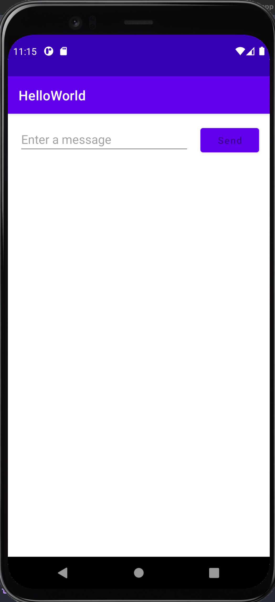
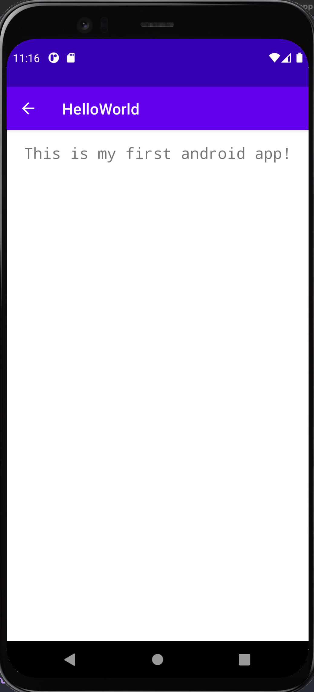

# Hello World - Display Message App

A simple Android app written in Java, based on the official Android starter docs

# Required Tech

Android Studio

# Setup & Launch

* Open project in Android Studio and run!

# Using app

* Enter a message
* Click SEND

The message is displayed when button is clicked

Go back to main menu by clicking the Up (back) button in the App Bar 

# Credits

* <a href="https://developer.android.com/training/basics/firstapp">Official Android Docs: Build your first app</a>

# Got Questions? Contact me!
efim@shulginmusic.com